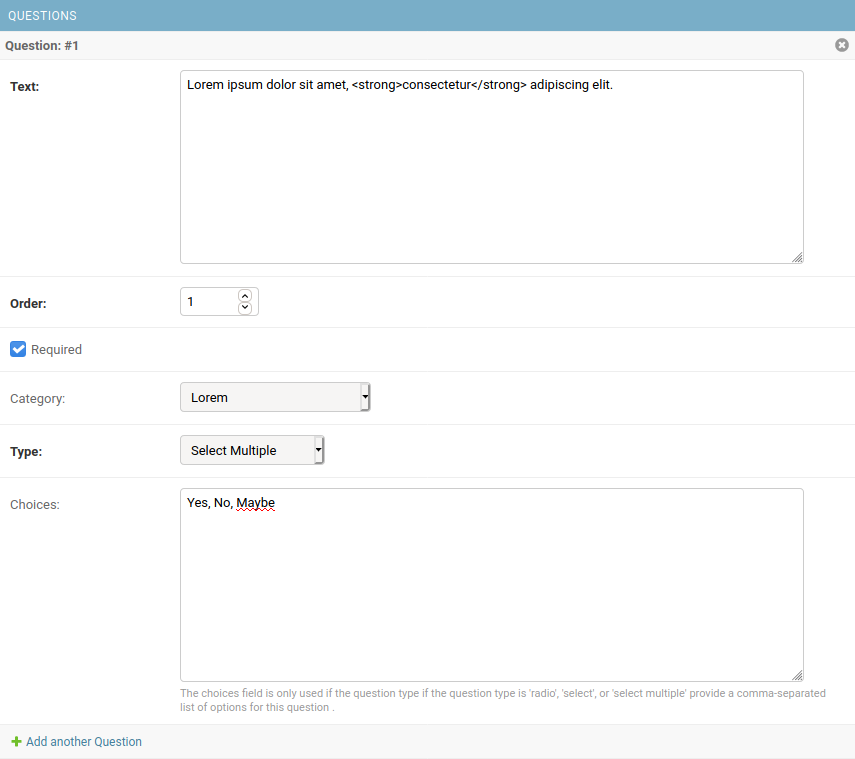

# Making a survey

Using the admin interface you can create surveys, add questions, give questions
categories, and mark them as required or not. You can define choices for answers using
comma separated words.

The front-end survey view then automatically populates based on the questions that have
been defined and published in the admin interface. We use bootstrap3 to render them.

Submitted responses can be viewed via the admin backend, in an exported csv or in a pdf
generated with latex.
